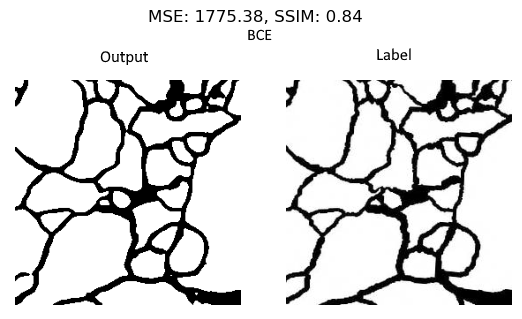
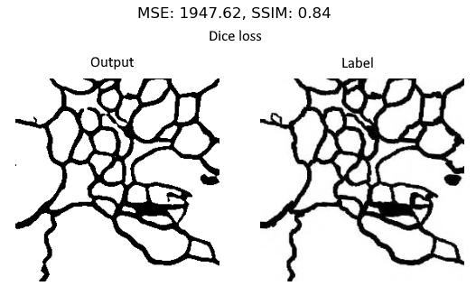

# Recreation of ”U-Net: Convolutional Networks for Biomedical Image Segmentation”
This github repository contains the code of a reimplementation of ”U-Net: Convolutional Networks for Biomedical Image Segmentation, by Olaf Ronneberger, Philipp Fischer, and Thomas Brox”
This is an assignment for the KTH course DD2424.

The report this project is based on can be found [here](https://arxiv.org/pdf/1505.04597.pdf)

  
## Requirements
* pytest
* numpy
* pytorch
* pillow

## Install requirements
Run the following command in the terminal to install requirements.
`pip install -r requirements.txt`
If you want more information about the available GPU install pycuda by:
`pip install pycuda`
*Note* pycuda requiers [CUDA](https://developer.nvidia.com/cuda-downloads) and [Visual Studio](https://visualstudio.microsoft.com/)

## Run tests 
Make sure that you are in the root folder for the project and run the command.
`python -m pytest`

## Run the network
In the main method in U_net.py you can select which tests that should be preformed. Set generate_augmented_data to true in order to generate data, note if you already have the data, set it to false.
* Run `python setup.py install --user`
* Run `python src/network/U_net.py`

## Tensorboard
* You need tensorflow installed `pip install tensorflow`
* Start tensorboard with `tensorboard --logdir=runs`

## Github tips
* `git checkout -b branchname` create a branch
* Push your changes to the branch and create a pull-requst via this github page
* If the tests passes, merge the and delete the branch
